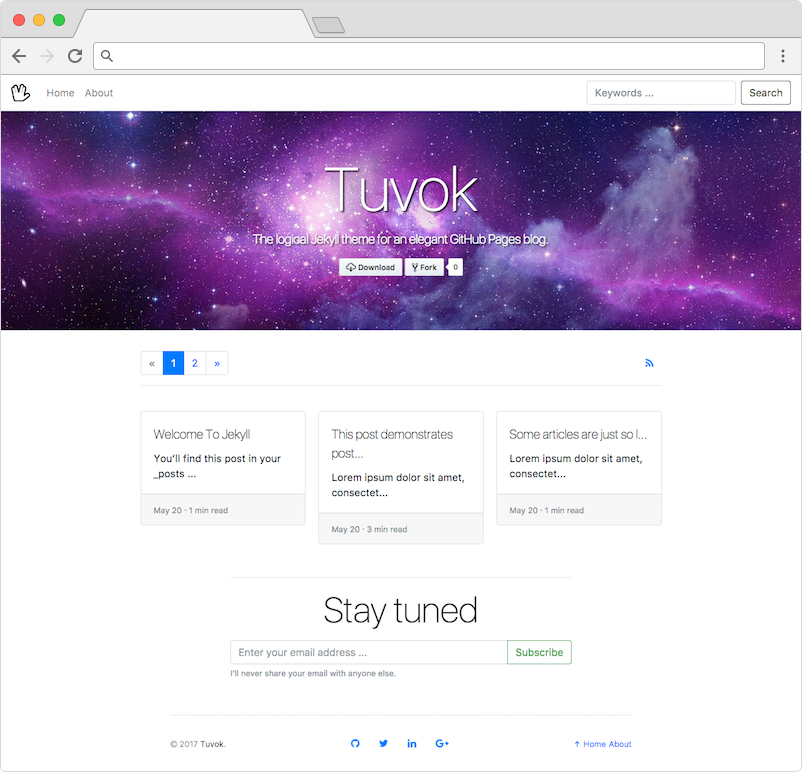

## Tuvok
The logical Jekyll theme for an elegant GitHub Pages blog.

## Installation

  git clone https://github.com/danrpts/tuvok.git
  cd tuvok
  bundle install

## Usage

  bundle exec jekyll serve

## Configuration

## Credits
Daniel Peterson <danrpts@gmail.com>

## License
GPLv3
